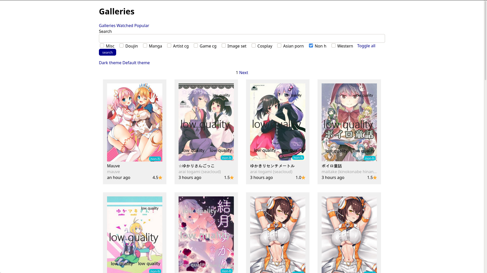
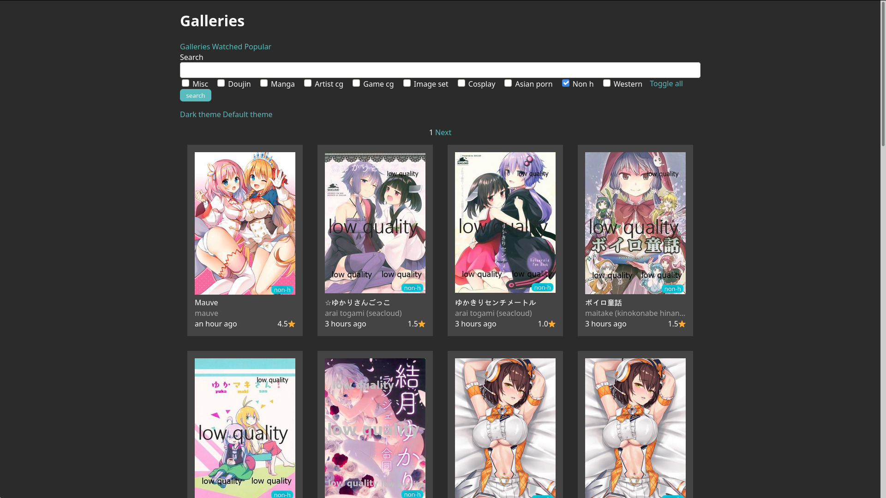
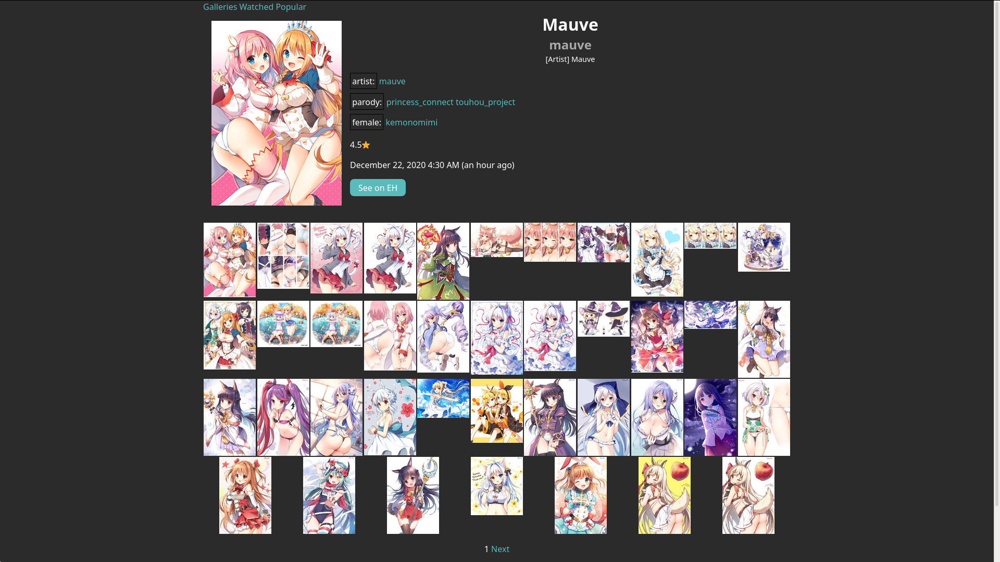
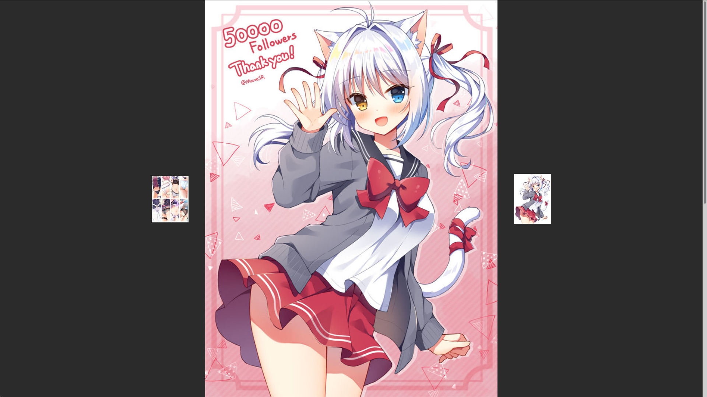
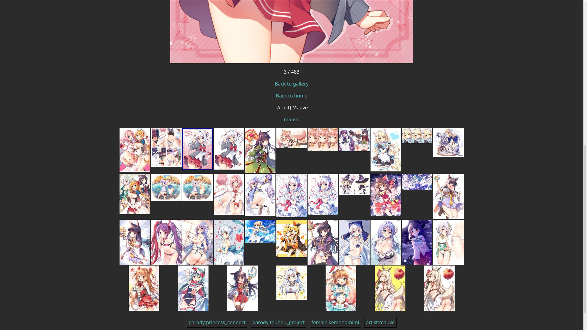

# SuperPanda

SuperPanda is a webclient to access SadPanda (e-hentai.org/exhentai.org).

It works by downloading the web pages then parsing them to extract the
information, and then outputs it in templates.

I made this because I was unhappy of the styling capabilities I had with custom
CSS, so I decided to rewrite entirely the HTML of the site.

## Main features

- Show tags in grid view by hovering the cover
- Stripped down titles, hover to show full title
- Keyboard shortcuts everywhere
- Theme system
- Responsive galleries list, use it on desktop, mobile or tablets
- Distraction free and always full size reader
- Turn pages using your left hand so you can keep your right hand free :eyes:
- Easy to read and understand HTML structure and classes, easy custom themes!
- Entirely exposed JSON API, write your own clients or tools using SuperPanda
- Open source (and welcoming pull requests!)

## Missing features

Those are planned but not done yet.

- Login to EH accounts using web UI (only manually pasting cookies currently)
- Adding more settings other than theme, such as layout tweaks
- Support viewing favorited galleries
- Support viewing and posting comments

## Keyboard shortcuts reference

Key         | Page           | Action
------------|----------------|-------
f           | Everywhere     | Toggle fullscreen
k/w/z       | Everywhere     | Scroll up
j/s         | Everywhere     | scroll down
a/q/h/left  | Reader         | Go to previous page
d/l/right   | Reader         | Go to next page
g/backspace | Reader         | Go back to gallery
e/t         | Reader/Gallery | Go back to home
c           | Gallery        | Search galleries by first character
a           | Gallery        | Search galleries by first artist
g           | Gallery        | Search galleries by first group
p           | Gallery        | Search galleries by first parody

## Running

For convenience, there are scripts in the `./scripts/` folder.

To run manually, first of set up a Python virtual environment using your
preferred tools, here we'll use venv.
```
python -m venv .venv
```
Now install the dependencies in it
```
# Linux / Mac OS
source .venv/bin/activate
# Windows
.venv\Scripts\activate.bat

pip install -r requirements.txt
```
Now run with
```
flask run
```

Environment variables:
- You can change the port using `FLASK_RUN_PORT`
- You can enable debug mode by setting `FLASK_DEBUG`
- You createcan change the IP address to bind to using `FLASK_RUN_HOST`

## Screenshots

Galleries (home page)



Galleries (dark theme)



A gallery



The reader, pictures always take the full available height of the page



Scrolling on the reader gives more information about the current gallery


